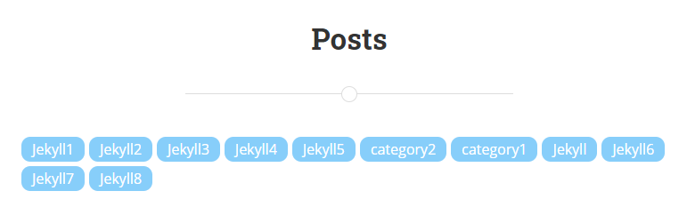
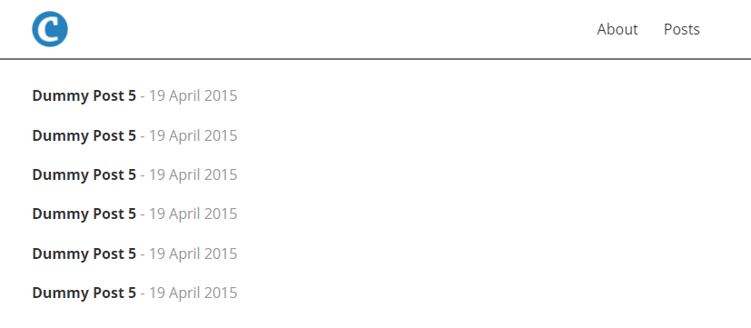
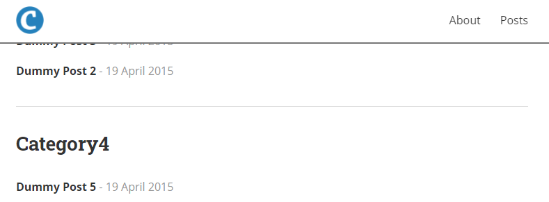

# Category로 태그 만들기

Posts에서 카테고리를 간단하게 찾을 수 있도록 HTML의 `anchor`를 이용한 카테고리 태그를 만들어보자.



## 1. 태그 이동 기능 추가

Category의 종류는 각 post에 입력되며 [Jekyll에 의해 `Global Variable`로 관리된다.](https://jekyllrb.com/docs/variables/)

- 카테고리 태그를 보여줄 Posts 화면 파일 `posts.md`에 다음 코드를 추가한다.

  ```html
  <div>
    
    <div><a href="#{{ category | first }}">{{ category | first }}</a></div>
    
  </div>
  ```

- a tag 클릭 시 이동할 Title에 Anchor를 걸어준다.

  ```html
  <h2 id="{{cat}}">{{ cat | capitalize }}</h2>
  ```

이제 추가된 카테고리 태그를 클릭하면 해당 카테고리 위치로 이동할 수 있다.

## 2. 스타일 추가

위에서 추가한 html 코드에 적절한 class를 추가해준 후, `_sass/_layout.scss`에 원하는대로 스타일링을 해보자.

나는 간단하게 이렇게 구현했다.

```scss
.categories-box {
  display: flex;
  flex-flow: wrap;
  .category-box {
    margin-right: 5px;
    margin-bottom: 5px;
    border-radius: 10px;
    background-color: lightskyblue;
    padding: 0px 12px;
    .category-content {
      color: white;
    }
  }
}
```

## 3. Anchor 위치 조정

카테고리를 클릭하면 해당 카테고리의 위치로 가지만 Layout에 헤더가 존재하는 Jekyll 템플릿에서는 카테고리가 가려진다.


Dummy Posts 5 위에 Category가 있지만 헤더에 가려진 상태이다.

JavaScript의 앵커링 시 이벤트 리스터를 추가하여 조절하는 방법도 있지만, 간단한 CSS 트릭을 이용해보자.

1.  Hidden Anchor 생성

    1번에서 정의했던 id 태그를 지우고, 새로운 Anchor를 생성한다.

    ```html
    <h2>{{ cat | capitalize }}</h2>
    <div id="{{cat}}" class="anchor"></div>
    ```

2.  css를 수정하여 `anchor`의 위치를 위로 적당량 올려준다.

    ```scss
    // in _layout.css
    .anchor {
      display: block;
      position: relative;
      top: -250px;
      visibility: hidden;
    }
    ```

3.  이제 Tag를 클릭하면 카테고리 이름이 잘 보인다.

    

    Tag를 클릭하면 보이지않는 Anchor로 이동하고 Anchor는 카테고리 이름보다 250픽셀 위에 위치하고 있기 때문에 카테고리 명을 확인할 수 있다.

간단한 방법으로 Category 태그를 만들어 보았다.

이후에는

- 글에 달린 Tags 정보를 보여주고 이 태그로 필터링 기능

- 댓글 기능

을 추가해볼 계획이다.
